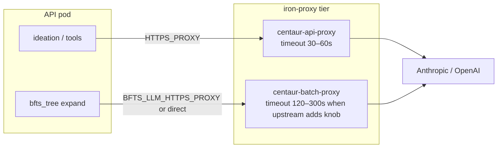

# BFTS batch iron-proxy — architecture sketch

Design for isolating **long-running, bursty LLM egress** (BFTS expand, VLM plot review) from **interactive** tool traffic (Slack agent turns, web search, ideation) without reintroducing app-level global semaphores like `BFTS_LLM_MAX_INFLIGHT`.

**Status (2026-05-27):**

| Piece | State |
|-------|--------|
| Overlay `BFTS_LLM_HTTPS_PROXY` routing | Shipped |
| Infra `centaur-batch-proxy` Deployment + NetworkPolicy | Shipped (`centaur-lab-infra`) |
| iron-proxy upstream timeout on batch pool | **Not available without upstream chart change** — batch proxy shares `centaur-api-proxy-config` and still hits ~30s synthetic 502s |
| **`BFTS_LLM_DIRECT_EGRESS` (interim fix)** | Shipped — trusted API workflow workers call Anthropic directly |
| Live Slack tree-search stream updates | Shipped — `bfts_root` polls `bfts_nodes` every 90s while trees run |

---

## Problem

Centaur routes outbound HTTPS from the API pod through a single iron-proxy endpoint:

```text
packages/bfts_sdk/llm.py  ──httpx──►  HTTPS_PROXY  ──►  centaur-api-proxy:8080  ──►  Anthropic
workflows/ideation.py     ──httpx──►  (same path)
tools/* (agent turns)     ──httpx──►  (same path)
```

Today that proxy is the **API pod iron-proxy sidecar** (Service `centaur-api-proxy`, chart helper `centaur.firewallProxyUrl`). Cluster evidence on dev:

| Symptom | Root cause |
|---------|------------|
| `LLM call failed: 502 bad gateway` on expand | iron-proxy **`timeout awaiting response headers` ~30s**, not Anthropic 502 |
| `ideation` stuck in `waiting` | `WORKFLOW_WORKER_CONCURRENCY` slots held by long BFTS runs (Phase 4); Phase 5a fixes orchestration, not proxy |
| Raising `num_workers` makes 502s worse | More concurrent Anthropic calls through one proxy with a short upstream timeout |
| Slack BFTS stream silent for hours | `bfts_root` only posted at kickoff + tree completion (fixed: periodic stream polls) |

Phase 5a caps **workflow worker** usage (one tree run, in-tree `num_workers` semaphore). That does **not** cap **iron-proxy** concurrency or fix the **30s upstream timeout**. An in-process `BFTS_LLM_MAX_INFLIGHT` semaphore was a tactical admission control band-aid; egress policy belongs in infra + search hyperparams.

---

## Interim fix without forking Centaur: trusted direct egress

Upstream iron-proxy YAML ([`services/iron-proxy/iron-proxy.yaml`](https://github.com/paradigmxyz/centaur/blob/main/services/iron-proxy/iron-proxy.yaml)) does **not** expose an upstream header timeout knob today. Increment 1b (standalone batch Deployment) therefore **isolates traffic but does not fix 502s** when it mounts the same rendered ConfigMap as the interactive pool.

**Overlay alternative (no Centaur fork):** set `BFTS_LLM_DIRECT_EGRESS=1` on the API pod.

```text
bfts_tree (API workflow worker, trusted control plane)
  → httpx direct to api.anthropic.com
  → Authorization from centaur_sdk.secret("ANTHROPIC_API_KEY")
```

| Property | Detail |
|----------|--------|
| Scope | **API pod workflow workers only** — BFTS expand + VLM httpx clients in `packages/bfts_sdk/llm.py` / `tools/bfts_vlm` |
| Sandboxes | Unchanged — agent sandboxes and BFTS executor pods still use per-sandbox iron-proxy |
| Secrets | Real keys resolve via `centaur_sdk.secret` in the control plane (same backend as iron-proxy env injection) |
| When `BFTS_LLM_DIRECT_EGRESS=1` | `resolve_llm_https_proxy()` returns `None` even if `BFTS_LLM_HTTPS_PROXY` is set |

Infra example (`centaur-lab-infra/clusters/.../values/centaur.yaml`):

```yaml
api:
  extraEnv:
    BFTS_LLM_DIRECT_EGRESS: "1"
    # Keep batch proxy deployed for future timeout split; ignored while direct egress is on.
    BFTS_LLM_HTTPS_PROXY: "http://centaur-batch-proxy:8080"
```

**Tradeoffs:** Loses per-request iron-proxy audit transforms for BFTS LLM calls (acceptable on a trusted dev cluster; revisit before prod). Removes synthetic 502s immediately without waiting for upstream chart work.

---

## Long-term: Centaur Apps (no fork, platform-native isolation)

Centaur's work-in-progress [**Creating Apps**](https://centaur.ai/extend/apps) design describes a PaaS layer for agent-adjacent software: independently versioned repos deployed beside the control plane with their own NetworkPolicy egress and lifecycle. That is the platform-native end state for **BFTS-as-a-batch-workload** — a dedicated app release with its own iron-proxy policy (long timeout, separate replicas) without forking `paradigmxyz/centaur`.

Until Apps land in production, the overlay uses **direct egress on the API pod** plus the hand-rolled batch proxy Deployment as staging infra for a future chart-owned dual pool.

---

## Design goals

1. **Interactive traffic stays snappy** — short proxy timeouts acceptable for Slack turns and quick tool calls.
2. **Batch LLM traffic gets headroom** — longer upstream timeout and independently tunable capacity.
3. **No secret duplication** — batch proxy uses the same iron-proxy image, CA, and secret source as the primary proxy.
4. **Minimal overlay surface** — route only BFTS-owned httpx clients through the batch proxy; everything else keeps `HTTPS_PROXY`.
5. **Observable** — timeout and 502 rates split by proxy pool in logs/metrics.

## Non-goals

- Moving BFTS LLM calls into sandbox pods (exec-only contract stays).
- Global asyncio semaphores in application code.

---

## Recommended path (three increments)

### Increment 0 — Raise timeout on existing proxy (upstream; blocked without chart change)

**Owner:** upstream `.centaur` chart + iron-proxy config template.

Expose upstream read/header timeout in `services/iron-proxy/iron-proxy.yaml` and set via Helm values:

| Environment | Suggested timeout |
|-------------|-------------------|
| dev / laptop | 120s |
| prod | 300s |

**Interim until upstream ships this:** `BFTS_LLM_DIRECT_EGRESS=1` on the API pod (see above).

### Increment 1 — Dedicated batch proxy Service (traffic split shipped; timeout pending)

Add a **second iron-proxy listener** reachable only from API workflow workers, tuned for batch workloads.



**1b (centaur-lab-infra today):** standalone `centaur-batch-proxy` Deployment + NetworkPolicy. **Requires a batch-specific ConfigMap with extended timeout once upstream exposes the field** — sharing `centaur-api-proxy-config` does not help.

#### Overlay code

| Module | Change |
|--------|--------|
| `packages/bfts_sdk/config.py` | `resolve_llm_https_proxy()`, `llm_direct_egress_enabled()` |
| `packages/bfts_sdk/llm.py` | `llm_http_client()` honors direct egress + optional batch proxy |
| `tools/bfts_vlm/client.py` | Same via `llm_http_client()` |
| `workflows/bfts_root.py` | Poll `bfts_nodes` → Slack stream steps while trees run |
| `tools/bfts_runner/slack/progress.py` | Snapshot queries + formatting |

Do **not** change global `HTTPS_PROXY` — ideation and agent tools keep the interactive pool.

### Increment 2 — Capacity and SLO (prod)

| Knob | Purpose |
|------|---------|
| `ironProxyBatch.replicaCount` / HPA | Scale batch pool when many concurrent `bfts_root` runs |
| `num_workers`, `num_drafts` | Application-level parallelism budget (still required) |
| VictoriaLogs / metrics | Alert on `duration_ms ≈ timeout` and 502 rate **by Service name** |
| Anthropic org rate limits | Hard ceiling above proxy tuning |

---

## What we explicitly rejected

### `BFTS_LLM_MAX_INFLIGHT` (removed from Phase 5a branch)

A process-wide `asyncio.Semaphore` in `packages/bfts_sdk/llm.py`:

- Hides infra misconfiguration (30s timeout) instead of fixing it.
- Throttles **all** BFTS LLM callers in the pod equally (expand + reflection + VLM).
- Fights Phase 5a's intentional `num_workers` semaphore inside each tree.
- Does not protect interactive tools on the shared primary proxy.

**Replacement:** direct egress (interim) + upstream timeout / batch pool (long-term) + existing `num_workers` / `num_drafts`.

---

## Rollout checklist

- [ ] Upstream: configurable iron-proxy upstream timeout (Increment 0)
- [x] Infra: deploy `centaur-batch-proxy` + NetworkPolicy (Increment 1b)
- [x] Overlay: `BFTS_LLM_HTTPS_PROXY` in `llm.py` + `bfts_vlm`
- [x] Infra: `api.extraEnv.BFTS_LLM_HTTPS_PROXY` in `centaur.yaml`
- [x] Interim: `BFTS_LLM_DIRECT_EGRESS=1` on API pod until batch timeout exists
- [x] Overlay: live Slack tree-search stream polls (`bfts_root` + `slack/progress.py`)
- [ ] Validate: one `bfts_root` run completes without 502 at 30s (direct egress)
- [ ] Validate: Slack agent turn still uses `centaur-api-proxy` only
- [ ] When upstream timeout lands: disable direct egress; point batch pool at dedicated ConfigMap

---

## Open upstream questions

1. **Sidecar vs Deployment** — long-term, should batch proxy be a second sidecar or a shared cluster Service?
2. **iron-proxy upstream timeout** — expose in YAML / Helm (Increment 0).
3. **Centaur Apps** — deploy BFTS controller as an app with isolated egress ([Creating Apps](https://centaur.ai/extend/apps)).
4. **Sandbox iron-proxy** — BFTS executor sandboxes are exec-only today; out of scope for current BFTS LLM path.

---

## Related docs

- `docs/bfts-phase5-orchestration.md` — Phase 5a in-tree expand (orchestration tier)
- `docs/bfts-deployment-architecture.md` — cluster tuning, 502 root-cause notes
- [Centaur: Creating Apps](https://centaur.ai/extend/apps) — future PaaS layer for isolated batch workloads
- `.centaur/contrib/chart/templates/_helpers.tpl` — `centaur.firewallProxyUrl` → `centaur-api-proxy`
