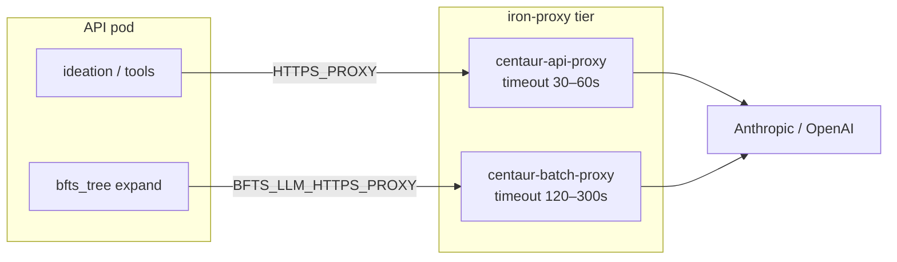

# BFTS batch iron-proxy — architecture sketch

Design for isolating **long-running, bursty LLM egress** (BFTS expand, VLM plot review) from **interactive** tool traffic (Slack agent turns, web search, ideation) without reintroducing app-level global semaphores like `BFTS_LLM_MAX_INFLIGHT`.

**Status:** overlay routing implemented (`BFTS_LLM_HTTPS_PROXY`); infra Deployment still pending — see rollout checklist below.

---

## Problem

Centaur routes outbound HTTPS from the API pod through a single iron-proxy endpoint:

```text
packages/bfts_sdk/llm.py  ──httpx──►  HTTPS_PROXY  ──►  centaur-api-proxy:8080  ──►  Anthropic
workflows/ideation.py     ──httpx──►  (same path)
tools/* (agent turns)     ──httpx──►  (same path)
```

Today that proxy is the **API pod iron-proxy sidecar** (Service `centaur-api-proxy`, chart helper `centaur.firewallProxyUrl`). Cluster evidence on dev:

| Symptom | Root cause |
|---------|------------|
| `LLM call failed: 502 bad gateway` on expand | iron-proxy **`timeout awaiting response headers` ~30s**, not Anthropic 502 |
| `ideation` stuck in `waiting` | `WORKFLOW_WORKER_CONCURRENCY` slots held by long BFTS runs (Phase 4); Phase 5a fixes orchestration, not proxy |
| Raising `num_workers` makes 502s worse | More concurrent Anthropic calls through one proxy with a short upstream timeout |

Phase 5a caps **workflow worker** usage (one tree run, in-tree `num_workers` semaphore). That does **not** cap **iron-proxy** concurrency or fix the **30s upstream timeout**. An in-process `BFTS_LLM_MAX_INFLIGHT` semaphore was a tactical admission control band-aid; egress policy belongs in infra + search hyperparams.

---

## Design goals

1. **Interactive traffic stays snappy** — short proxy timeouts acceptable for Slack turns and quick tool calls.
2. **Batch LLM traffic gets headroom** — longer upstream timeout and independently tunable capacity.
3. **No secret duplication** — batch proxy uses the same iron-proxy image, CA, and secret source as the primary proxy.
4. **Minimal overlay surface** — route only BFTS-owned httpx clients through the batch proxy; everything else keeps `HTTPS_PROXY`.
5. **Observable** — timeout and 502 rates split by proxy pool in logs/metrics.

## Non-goals

- Moving BFTS LLM calls into sandbox pods (exec-only contract stays).
- Replacing iron-proxy with direct Anthropic egress from the API pod.
- Global asyncio semaphores in application code.

---

## Recommended path (three increments)

### Increment 0 — Raise timeout on existing proxy (do first)

**Owner:** upstream `.centaur` chart + iron-proxy config template.

Expose upstream read/header timeout in `services/iron-proxy/iron-proxy.yaml` (or iron-proxy env) and set via `ironProxy.upstreamTimeout` in Helm values:

| Environment | Suggested timeout |
|-------------|-------------------|
| dev / laptop | 120s |
| prod | 300s |

**Pros:** One-line infra fix; removes most synthetic 502s with no traffic split.  
**Cons:** Interactive calls also inherit the longer timeout (usually fine).

Ship this even if batch split is deferred.

### Increment 1 — Dedicated batch proxy Service (recommended split)

Add a **second iron-proxy listener** reachable only from API workflow workers, tuned for batch workloads.



#### Infra options (pick one)

| Option | How | Tradeoff |
|--------|-----|----------|
| **1a. Second sidecar on API pod** | Upstream K8s sandbox backend adds `iron-proxy-batch` container beside existing `iron-proxy`; second Service selects same pod with different port | Shares pod network; no extra Deployment; requires upstream sidecar work |
| **1b. Standalone Deployment** | `centaur-batch-proxy` Deployment + Service in `centaur-lab-infra` Argo app; same image/secret mounts as chart | Faster to prototype in infra repo; extra pod to operate; must wire NetworkPolicy API → batch Service |

**1b is the fastest overlay-adjacent prototype** if upstream sidecar work is queued.

Example infra sketch (`centaur-lab-infra` — illustrative):

```yaml
# clusters/.../values/centaur.yaml
api:
  extraEnv:
    BFTS_LLM_HTTPS_PROXY: "http://centaur-batch-proxy.centaur-system.svc:8080"
    # HTTPS_PROXY unchanged → centaur-api-proxy for interactive tools

ironProxyBatch:
  enabled: true
  replicaCount: 2
  upstreamTimeout: 300s
  resources:
    requests: { cpu: "250m", memory: 256Mi }
    limits:   { cpu: "1", memory: 512Mi }
```

NetworkPolicy: allow `component=api` pods → `centaur-batch-proxy:8080` (mirror existing `iron-proxy-api` policy).

#### Overlay code (small, explicit)

Only BFTS-owned httpx clients honor the override:

| Module | Change |
|--------|--------|
| `packages/bfts_sdk/config.py` | `resolve_llm_https_proxy()` reads `BFTS_LLM_HTTPS_PROXY` |
| `packages/bfts_sdk/llm.py` | `llm_http_client()` uses batch proxy when set, else httpx `HTTPS_PROXY` default |
| `tools/bfts_vlm/client.py` | Same via `llm_http_client()` |

Do **not** change global `HTTPS_PROXY` — ideation and agent tools keep the interactive pool.

Config resolution order:

1. Per-run input (future: `bfts_root.Input.llm_https_proxy` if ever needed)
2. `BFTS_LLM_HTTPS_PROXY` env (`api.extraEnv`)
3. Fall back to `HTTPS_PROXY` (dev laptops without batch Service)

### Increment 2 — Capacity and SLO (prod)

| Knob | Purpose |
|------|---------|
| `ironProxyBatch.replicaCount` / HPA | Scale batch pool when many concurrent `bfts_root` runs |
| `num_workers`, `num_drafts` | Application-level parallelism budget (still required) |
| VictoriaLogs / metrics | Alert on `duration_ms ≈ timeout` and 502 rate **by Service name** |
| Anthropic org rate limits | Hard ceiling above proxy tuning |

**Concurrency budgeting (rule of thumb):**

```text
peak_batch_llm_inflight ≈ concurrent_trees × num_drafts × num_workers × ~7 LLM calls per expand
```

Example: 2 concurrent research jobs, `num_drafts=2`, `num_workers=2` → up to ~56 in-flight LLM HTTP requests at peak. Batch proxy replicas and provider quota must be sized for that, not hidden behind a global semaphore.

---

## What we explicitly rejected

### `BFTS_LLM_MAX_INFLIGHT` (removed from Phase 5a branch)

A process-wide `asyncio.Semaphore` in `packages/bfts_sdk/llm.py`:

- Hides infra misconfiguration (30s timeout) instead of fixing it.
- Throttles **all** BFTS LLM callers in the pod equally (expand + reflection + VLM).
- Fights Phase 5a's intentional `num_workers` semaphore inside each tree.
- Does not protect interactive tools on the shared primary proxy.

**Replacement:** Increment 0 (timeout) + Increment 1 (batch pool) + existing `num_workers` / `num_drafts`.

---

## Rollout checklist

- [ ] Upstream: configurable iron-proxy upstream timeout (Increment 0)
- [ ] Infra: deploy `centaur-batch-proxy` or second sidecar (Increment 1)
- [x] Overlay: `BFTS_LLM_HTTPS_PROXY` in `llm.py` + `bfts_vlm` (Increment 1)
- [ ] Infra: `api.extraEnv.BFTS_LLM_HTTPS_PROXY` in `centaur.yaml`
- [ ] NetworkPolicy: API → batch proxy
- [ ] Validate: one `bfts_root` run with `num_workers=2`; proxy logs show batch Service; no 502 at 30s
- [ ] Validate: Slack agent turn still uses `centaur-api-proxy` only

---

## Open upstream questions

1. **Sidecar vs Deployment** — long-term, should batch proxy be a second sidecar (no extra scheduling) or a shared cluster Service (simpler HPA)?
2. **iron-proxy upstream timeout** — is 30s hardcoded in iron-proxy 0.39.x or only in Centaur's rendered config?
3. **Sandbox iron-proxy** — BFTS executor sandboxes are exec-only today; if future work moves any LLM into sandboxes, those pods need their own batch proxy env — out of scope for current BFTS path.

---

## Related docs

- `docs/bfts-phase5-orchestration.md` — Phase 5a in-tree expand (orchestration tier)
- `docs/bfts-deployment-architecture.md` — cluster tuning, 502 root-cause notes
- `.centaur/contrib/chart/templates/_helpers.tpl` — `centaur.firewallProxyUrl` → `centaur-api-proxy`
