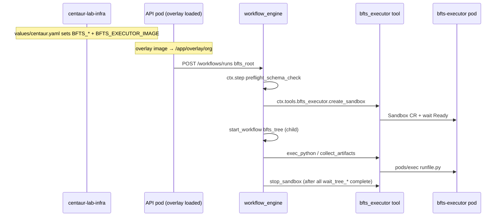

# BFTS deployment architecture

How Best-First Tree Search (BFTS) maps onto Centaur's
[ACME three-repo split](https://centaur.run/extend/acme-example): kernel,
organization overlay, and GitOps infra. This doc emphasizes **directory shapes**
and **where code lives**, with pointers to upstream examples.

---

## Three repos at a glance

Centaur's recommended layout (from
[ACME example](https://centaur.run/extend/acme-example)):

```text
your-org/
├── centaur/              # upstream kernel — you pin a SHA, you do not fork behavior here
├── centaur-overlay/      # org tools, workflows, skills (fork of centaur-acme)
└── centaur-infra/        # Argo CD + Helm values + secrets (fork of centaur-acme-infra)
```

Your deployment uses the same split with different names:

```text
Mperhats/
├── paradigmxyz/centaur           →  .centaur/ submodule in centaur-lab (pinned SHA)
├── centaur-lab                   →  overlay repo (this repo)
└── centaur-lab-infra             →  GitOps repo
```

| Role | Upstream template | Your repo | What you edit |
|------|-------------------|-----------|---------------|
| Kernel | [`paradigmxyz/centaur`](https://github.com/paradigmxyz/centaur) | `.centaur/` submodule | Bump submodule SHA only |
| Overlay | [`paradigmxyz/centaur-acme`](https://github.com/paradigmxyz/centaur-acme) | [`centaur-lab`](https://github.com/Mperhats/centaur-lab) | Tools, workflows, skills, migrations |
| Infra | [`paradigmxyz/centaur-acme-infra`](https://github.com/paradigmxyz/centaur-acme-infra) | [`centaur-lab-infra`](https://github.com/Mperhats/centaur-lab-infra) | Helm values, Argo CD, cluster secrets |

### ACME overlay vs centaur-lab overlay

The ACME overlay is intentionally minimal — one toy tool, one workflow, one skill.
Your overlay extends that same shape with BFTS and research tooling.

**Upstream template** ([acme-example §2](https://centaur.run/extend/acme-example)):

```text
centaur-acme/                         # paradigmxyz/centaur-acme
├── Dockerfile                        # COPY . /overlay
├── tools/
│   └── acme_crm/                     # toy CRM tool
│       ├── client.py
│       └── pyproject.toml            # [tool.centaur] registration
├── workflows/
│   └── daily_acme_brief.py           # WORKFLOW_NAME + handler
├── .agents/skills/
│   └── acme-support/SKILL.md
└── services/sandbox/
    └── SYSTEM_PROMPT.md
```

**Your overlay** (same extension points, more content):

```text
centaur-lab/
├── Dockerfile                        # same pattern as ACME
├── Dockerfile.bfts-executor          # ← BFTS-only: separate runtime image (not in ACME)
├── pyproject.toml                    # uv workspace (dev); not shipped in overlay image
│
├── tools/                            # API discovers via TOOL_DIRS
│   ├── bfts_executor/                # K8s Sandbox CR operator (privileged)
│   │   ├── client.py
│   │   ├── pyproject.toml
│   │   └── network_policy.py
│   ├── bfts_vlm/                     # VLM plot review
│   ├── semantic_scholar/             # S2 API + projections/
│   └── personas/scientist/           # persona entry (pyproject + PROMPT.md)
│
├── workflows/                        # API discovers via WORKFLOW_DIRS
│   ├── bfts_root.py                  # entry: fan-out trees + sandbox lifecycle
│   ├── bfts_tree.py
│   ├── bfts_expand_one.py
│   ├── bfts_reflection_nightly.py
│   ├── ideation.py
│   ├── research_brief.py
│   ├── save_papers.py
│   └── gather_citations.py
│
├── packages/
│   └── bfts_sdk/                     # controller library (imported by workflows)
│       ├── config.py
│       ├── state.py
│       ├── expand.py
│       └── pyproject.toml
│
├── .agents/skills/                   # sandbox copies at agent startup
│   ├── academic-research/SKILL.md
│   └── bfts-experiments/SKILL.md
│
├── services/
│   ├── api/db/migrations/            # overlay-owned Postgres schema
│   │   ├── 20260525000001_add_bfts_tables.sql
│   │   └── …
│   └── sandbox/SYSTEM_PROMPT.md
│
├── tests/
├── .centaur/                         # git submodule → paradigmxyz/centaur
└── docs/
```

**Rule of thumb:** if ACME puts it in `tools/`, `workflows/`, `.agents/skills/`,
or `services/sandbox/`, you put BFTS stuff there too. BFTS adds `packages/bfts_sdk/`,
overlay migrations under `services/api/db/migrations/`, and a second Docker image
for experiment sandboxes.

---

## Repo 1: upstream kernel (`.centaur/`)

You do **not** fork this. The overlay repo pins it as a submodule and references
upstream paths in comments and docs.

```text
.centaur/                             # paradigmxyz/centaur @ pinned SHA
├── contrib/chart/                    # Helm chart Argo CD installs
│   ├── values.yaml                   # overlay.image.* defaults
│   └── templates/
│       ├── workloads.yaml            # TOOL_DIRS, WORKFLOW_DIRS, overlay bootstrap
│       ├── rbac.yaml                 # API SA sandbox-manager Role
│       └── networkpolicy.yaml
├── services/
│   ├── api/
│   │   ├── api/
│   │   │   ├── app.py                # loads TOOL_DIRS → ToolManager
│   │   │   ├── tool_manager.py       # reads [tool.centaur] from pyproject.toml
│   │   │   ├── workflow_engine.py    # loads WORKFLOW_DIRS
│   │   │   └── sandbox/
│   │   │       └── kubernetes_agent_sandbox.py   # agent Sandbox CR pattern
│   │   ├── entrypoint.sh             # uv pip install overlay tool deps
│   │   └── db/migrations/            # upstream schema (not bfts_*)
│   ├── sandbox/                      # agent harness image + entrypoint
│   └── slackbot/
├── tools/                            # built-in tools (merged with overlay)
├── workflows/                        # built-in workflows
└── docs/public/md/extend/
    ├── overlay.md                    # mount paths, discovery
    ├── acme-example.md               # three-repo template
    ├── tools.md
    └── workflows.md
```

### Upstream: overlay mount + discovery

Chart copies your overlay image into the API pod, then sets discovery paths
([overlay.md](https://centaur.run/extend/overlay),
`.centaur/contrib/chart/templates/workloads.yaml`):

```yaml
# workloads.yaml — overlay-bootstrap initContainer (when overlay.image.repository set)
initContainers:
  - name: overlay-bootstrap
    image: "ghcr.io/mperhats/centaur-lab/centaur-overlay:sha-ed6e9cc"
    command:
      - /bin/sh
      - -ec
      - |
        src="/overlay"
        target="/app/overlay/org"
        mkdir -p "$target"
        cp -R "$src"/. "$target"/
```

```yaml
# workloads.yaml — API container env (abbreviated)
- name: TOOL_DIRS
  value: "/app/tools:/app/overlay/org/tools"
- name: WORKFLOW_DIRS
  value: "/app/workflows:/app/overlay/org/workflows"
- name: CENTAUR_OVERLAY_DIR
  value: "/app/overlay/org"
```

Later path entries **shadow** earlier ones — overlay wins over built-ins when
names collide ([overlay.md §Discovery paths](https://centaur.run/extend/overlay)).

### Upstream: tool discovery

On API startup, `app.py` reads `TOOL_DIRS` and calls `ToolManager.discover()`:

```python
# .centaur/services/api/api/app.py
_tool_dirs_env = os.environ.get("TOOL_DIRS", "")
if _tool_dirs_env:
    _tools_dirs = [Path(d.strip()) for d in _tool_dirs_env.split(":") if d.strip()]
# … namespace merge …
tool_manager = ToolManager(_tools_dirs)
tool_manager.discover()
```

`tool_manager.py` walks each tool directory for `pyproject.toml` and reads
`[tool.centaur]` (module path, secrets for iron-proxy). See
[Creating Tools](https://centaur.run/extend/tools).

### Upstream: workflow discovery

External workflows load from `WORKFLOW_DIRS` into namespace `centaur.workflows.*`
(`.centaur/services/api/api/workflow_engine.py`). Each file must export
`WORKFLOW_NAME` and `handler`. See
[Creating Workflows](https://centaur.run/extend/workflows).

Built-in upstream workflow shape (for comparison):

```python
# .centaur/workflows/github_issue_triage.py
WORKFLOW_NAME = "github_issue_triage"

async def handler(payload: dict[str, Any], ctx: WorkflowContext) -> dict[str, Any]:
    await ctx.step("…", lambda: …)
    …
```

---

## Repo 2: centaur-lab (overlay) — file-by-file

### Overlay Dockerfile (identical pattern to ACME)

```dockerfile
# Dockerfile — mirrors upstream overlay.md
FROM alpine:3.20
WORKDIR /overlay
COPY . /overlay
```

`.dockerignore` excludes `.centaur/`, tests, `Dockerfile.bfts-executor`, etc.
The overlay image ships **static Python + skills + SQL**, not the submodule or
the executor runtime image.

### Tool shape: `tools/bfts_executor/`

Same contract as ACME's `tools/acme_crm/`: `client.py` + `pyproject.toml` +
`[tool.centaur]`.

**Registration** (`tools/bfts_executor/pyproject.toml`):

```toml
[project]
dependencies = [
    "dataclasses-json>=0.6.0",
    "kubernetes-asyncio>=29.0.0",
]

[tool.centaur]
module = "client.py"
# No secrets — uses in-cluster ServiceAccount for K8s API
```

**Factory** (discovered by ToolManager; methods become `ctx.tools.bfts_executor.*`):

```python
# tools/bfts_executor/client.py
def _client() -> BFTSExecutor:
    """Centaur tool factory: invoked once per API pod at discovery time."""
    return BFTSExecutor(sandbox_api=_KubernetesSandboxAPI())
```

Compare with a secret-bearing tool (`tools/semantic_scholar/pyproject.toml`):

```toml
[tool.centaur]
module = "client.py"
secrets = [
  {type = "http", name = "SEMANTIC_SCHOLAR_API_KEY", match_headers = ["x-api-key"],
   hosts = ["api.semanticscholar.org"]},
]
```

### Tool shape: HTTP-only tool with secrets

Follows upstream [Creating Tools](https://centaur.run/extend/tools) — iron-proxy
injects the real key on outbound requests; the API pod never passes raw secrets
to sandboxes.

### Workflow shape: `workflows/bfts_root.py`

Same exports as ACME's `daily_acme_brief.py`, plus BFTS-specific orchestration:

```python
# workflows/bfts_root.py
WORKFLOW_NAME = "bfts_root"

@dataclass
class Input:
    idea: dict[str, Any] = field(default_factory=dict)
    num_drafts: int | None = None
    …

async def handler(inp: Input, ctx: WorkflowContext) -> dict[str, Any]:
    await ctx.step(
        "preflight_schema_check",
        lambda: assert_bfts_schema_present(ctx._pool),
    )
    …
    await ctx.step(
        f"create_sandbox_{i}",
        lambda sid=sandbox_id: ctx.tools.bfts_executor.create_sandbox(
            sandbox_id=sid,
            run_id=ctx.run_id,
        ),
    )
    child = await ctx.start_workflow(
        f"start_tree_{i}",
        workflow_name="bfts_tree",
        run_input={…},
        trigger_key=child_run_id,
        eager_start=True,
    )
```

Key point: **`ctx.tools.bfts_executor`** resolves because `bfts_executor` is an
overlay tool on `TOOL_DIRS`. **`ctx.step`** checkpoints side effects in Postgres
(upstream workflow engine) — see
[Creating Workflows §Durable primitives](https://centaur.run/extend/workflows).

### Library shape: `packages/bfts_sdk/`

Not a separately discovered extension point — workflows import it directly:

```python
from packages.bfts_sdk.config import resolve_llm_settings, resolve_search_config
from packages.bfts_sdk.schema import assert_bfts_schema_present
```

Repo root `pyproject.toml` puts `.` and `packages/` on `pythonpath` for pytest;
the API pod puts the overlay root on `sys.path` the same way via `TOOL_DIRS`
parent insertion in `app.py`.

**Dependency invariant:** every third-party import in `packages/bfts_sdk/` or
`workflows/` must appear in some tool's `[project].dependencies`, because only
`TOOL_DIRS` is scanned at API pod startup (`.centaur/services/api/entrypoint.sh`).

### Migrations shape: `services/api/db/migrations/`

Overlay-owned tables — same pattern documented in
[`overlay-db-migrations.md`](overlay-db-migrations.md):

```sql
-- services/api/db/migrations/20260525000001_add_bfts_tables.sql
CREATE TABLE IF NOT EXISTS bfts_runs (
    run_id          TEXT PRIMARY KEY,
    parent_run_id   TEXT,
    idea_json       JSONB NOT NULL,
    …
);
```

Applied at API startup alongside upstream migrations.

### BFTS-only: second image (`Dockerfile.bfts-executor`)

Not part of the ACME overlay pattern. Ephemeral Sandbox CR pods boot this image;
the overlay tool references it via env var.

```dockerfile
# Dockerfile.bfts-executor
FROM python:3.11-slim
RUN pip install --no-cache-dir numpy matplotlib scikit-learn "torch==2.5.1 ; platform_machine=='x86_64'"
WORKDIR /workspace
CMD ["sleep", "infinity"]
```

Pinned in infra, not baked into overlay:

```yaml
# centaur-lab-infra/values/centaur.yaml → api.extraEnv
BFTS_EXECUTOR_IMAGE: ghcr.io/mperhats/centaur-lab/bfts-executor:sha-…
```

---

## Repo 3: centaur-lab-infra (GitOps)

Mirrors [centaur-acme-infra](https://github.com/paradigmxyz/centaur-acme-infra)
layout; cluster name is `centaur-lab` instead of `acme-centaur`.

```text
centaur-lab-infra/
├── .env.example                      # secret schema → cp .env (gitignored)
├── pyproject.toml                    # uv run up | sync | bump | status | …
│
├── clusters/centaur-lab/
│   ├── README.md
│   └── argocd/
│       ├── bootstrap/
│       │   ├── 00-namespaces.yaml    # centaur-system, observability
│       │   ├── centaur.yaml          # Argo CD Application (3 sources)
│       │   └── argocd-cm-patches.yaml
│       ├── values/
│       │   └── centaur.yaml          # Helm overrides (BFTS_*, images, …)
│       └── apps/centaur/             # raw K8s beside chart (optional)
│           └── README.md             # "Place manifests not in Helm chart"
│
└── infra/                            # lifecycle scripts
    ├── up.py                         # bootstrap Argo CD + apply centaur.yaml
    ├── sync.py
    ├── bump.py                       # bump overlay sha from GHCR
    ├── secrets.py                    # .env → centaur-infra-env Secret
    └── cloudflared/                  # tunnel for Slack webhooks
```

### Argo CD Application (three sources)

Same pattern as ACME infra — chart from upstream, values from this repo:

```yaml
# clusters/centaur-lab/argocd/bootstrap/centaur.yaml
spec:
  sources:
    # 1. Upstream Helm chart (pinned SHA — do not track main in prod)
    - repoURL: https://github.com/paradigmxyz/centaur.git
      targetRevision: 0656aeb56c9e6e98507494cfb1c0408ffbf57b65
      path: contrib/chart
      helm:
        valueFiles:
          - $values/clusters/centaur-lab/argocd/values/centaur.yaml
        parameters:
          - name: overlay.image.repository
            value: ghcr.io/mperhats/centaur-lab/centaur-overlay
          - name: overlay.image.tag
            value: sha-ed6e9cc          # Argo CD Image Updater bumps this

    # 2. Values ref (this repo)
    - repoURL: https://github.com/Mperhats/centaur-lab-infra.git
      ref: values

    # 3. Optional raw manifests
    - repoURL: https://github.com/Mperhats/centaur-lab-infra.git
      path: clusters/centaur-lab/argocd/apps/centaur

  destination:
    namespace: centaur-system
```

Compare ACME ([acme-example §4](https://centaur.run/extend/acme-example)) — same
`overlay.image.repository` / `overlay.image.tag` parameters, different org GHCR path.

### Helm values (BFTS knobs)

```yaml
# clusters/centaur-lab/argocd/values/centaur.yaml
api:
  extraEnv:
    BFTS_DRAFT_MODEL: claude-sonnet-4-20250514
    BFTS_LLM_API_KEY_SECRET: ANTHROPIC_API_KEY
    WORKFLOW_WORKER_CONCURRENCY: "16"
    BFTS_EXECUTOR_IMAGE: ghcr.io/mperhats/centaur-lab/bfts-executor:sha-…

agentSandbox:
  enabled: true                        # required for Sandbox CRs
  controller:
    extensions: true

overlay: {}                            # image repo/tag set in centaur.yaml parameters
```

Secrets (`DATABASE_URL`, `SLACK_*`, model keys) live in Kubernetes Secret
`centaur-infra-env`, created from `.env` via `uv run secrets` — same keys as
[Deploying in Production](https://centaur.run/deploying-in-production).

---

## How the three repos connect at runtime

```text
┌─────────────────────────────────────────────────────────────────────────┐
│  centaur-lab-infra                                                      │
│  Argo CD Application installs chart + applies values + optional raw YAML│
└───────────────────────────────┬─────────────────────────────────────────┘
                                │
                                ▼
┌─────────────────────────────────────────────────────────────────────────┐
│  K8s namespace: centaur-system                                          │
│                                                                         │
│  ┌─────────────────────────────────────────────────────────────────┐   │
│  │ API pod                                                          │   │
│  │  initContainer: copy centaur-overlay:sha-* → /app/overlay/org   │   │
│  │  entrypoint.sh: uv pip install overlay tool pyproject deps        │   │
│  │  app.py: ToolManager(TOOL_DIRS) + workflow_engine(WORKFLOW_DIRS)│   │
│  │                                                                  │   │
│  │  /app/tools/              ← upstream built-ins                   │   │
│  │  /app/overlay/org/tools/  ← centaur-lab overlay (bfts_executor…) │   │
│  │  /app/overlay/org/workflows/ ← bfts_root.py, ideation.py, …      │   │
│  └───────────────────────────────┬─────────────────────────────────┘   │
│                                  │ creates Sandbox CRs + pods/exec      │
│                                  ▼                                      │
│  ┌─────────────────────────────────────────────────────────────────┐   │
│  │ BFTS Sandbox CR pods (bfts-executor image)                       │   │
│  │  label: centaur.ai/bfts-sandbox=true                             │   │
│  │  CMD: sleep infinity — workflow drives python via bfts_executor   │   │
│  └─────────────────────────────────────────────────────────────────┘   │
│                                                                         │
│  ┌──────────────────┐  ┌─────────────┐  ┌──────────────────────────┐  │
│  │ Agent sandboxes  │  │ Postgres    │  │ iron-proxy               │  │
│  │ (centaur-agent)  │  │ bfts_* rows │  │ LLM + S2 credentials     │  │
│  └──────────────────┘  └─────────────┘  └──────────────────────────┘  │
└─────────────────────────────────────────────────────────────────────────┘
```

### Inside the API pod after deploy

```text
/app/
├── tools/                          # upstream kernel tools
├── workflows/                      # upstream kernel workflows
└── overlay/org/                    # copied from centaur-overlay:sha-* image
    ├── tools/
    │   ├── bfts_executor/
    │   ├── bfts_vlm/
    │   └── semantic_scholar/
    ├── workflows/
    │   ├── bfts_root.py
    │   └── …
    ├── packages/bfts_sdk/          # on sys.path via overlay root
    ├── .agents/skills/
    └── services/api/db/migrations/
```

Verify ([acme-example §7](https://centaur.run/extend/acme-example)):

```bash
kubectl exec -n centaur-system deploy/centaur-centaur-api -- \
  sh -lc 'echo "$TOOL_DIRS"; echo "$WORKFLOW_DIRS"; ls /app/overlay/org/tools'
```

---

## BFTS run flow (which repo owns what)



### Sandbox lifecycle (do not wrap waits in `try/finally`)

Centaur replays a handler's `finally` block when the workflow **suspends** at
`wait_for_workflow`, not only on success or failure. If `stop_sandbox` lives in
`finally` around the tree-wait loop, all executor pods are deleted seconds after
kickoff while children still run (`stop_sandbox_0..N` checkpoints ~4s after
start). Runs `wfr_33d0f01a091f4681` and `wfr_958376d7950c46e8` exhibited this.

**Fix (overlay ≥ merge of PR #13):** provision sandboxes in a narrow
`try/except` (teardown only on provisioning failure), `wait_for_workflow` per
tree **outside** any `finally`, then explicit `_teardown_sandboxes` once all
trees finish. Redeploy the overlay image after merging; old SHAs still delete
pods early.

**Separate failure mode:** sustained `LLM call failed: 502 bad gateway` on
`bfts_expand_one` (as in `wfr_958376d7950c46e8`) is iron-proxy / provider
outage — `packages/bfts_sdk/llm.py` already retries 502 with backoff; check
VictoriaLogs and proxy health if zero good nodes appear with sandboxes still up.

| Step | Code location | Repo |
|------|---------------|------|
| Start run | `POST /workflows/runs` | upstream `.centaur/services/api` |
| `bfts_root` handler | `workflows/bfts_root.py` | centaur-lab |
| Controller logic | `packages/bfts_sdk/` | centaur-lab |
| Sandbox CR + exec | `tools/bfts_executor/client.py` | centaur-lab |
| Sandbox pod image | `Dockerfile.bfts-executor` | centaur-lab CI → GHCR |
| Image pin | `api.extraEnv.BFTS_EXECUTOR_IMAGE` | centaur-lab-infra |
| Tree state rows | `bfts_runs`, `bfts_nodes` | centaur-lab migrations → Postgres |

---

## Deploy checklist (ACME flow + BFTS)

### 1. Overlay repo (centaur-lab)

```bash
git submodule update --init --recursive
uv sync --all-packages
uv run pytest tests/
docker build -t ghcr.io/mperhats/centaur-lab/centaur-overlay:sha-$(git rev-parse --short HEAD) .
# CI on merge to main publishes to GHCR
```

### 2. Infra repo (centaur-lab-infra)

```bash
cp .env.example .env    # fill secrets
uv run up               # Argo CD + centaur Application
uv run status
```

Or manually ([acme-example §6](https://centaur.run/extend/acme-example)):

```bash
kubectl apply -f clusters/centaur-lab/argocd/bootstrap/00-namespaces.yaml
kubectl apply -f clusters/centaur-lab/argocd/bootstrap/centaur.yaml
```

### 3. Smoke a BFTS run

```bash
kubectl exec -n centaur-system deploy/centaur-centaur-api -- \
  curl -fsS -X POST http://localhost:8000/workflows/runs \
    -H "Content-Type: application/json" \
    -d '{"workflow_name":"bfts_root","input":{},"eager_start":true}' | jq

kubectl get sandboxes -n centaur-system -l centaur.ai/bfts-sandbox=true
```

### 4. Day-to-day (infra repo)

```bash
uv run bump      # newest overlay sha from GHCR
uv run sync      # apply + wait for rollout
uv run secrets   # refresh centaur-infra-env from .env
uv run clean     # GC leaked sandbox pods
```

---

## Future: fourth repo (`centaur-bfts` app)

[Creating Apps](https://centaur.run/extend/apps) is **🚧 not implemented** on
upstream `main`. When it lands, the overlay shrinks and BFTS logic moves to an
app repo — same three-repo split, plus:

```text
Mperhats/
├── centaur-lab/          # org overlay: shared research tools, bfts_executor, migrations
├── centaur-lab-infra/    # unchanged + POST /apps registration in CI
└── centaur-bfts/         # app: workflows, bfts_sdk, bfts_vlm, optional web UI
    ├── centaur.app.toml
    ├── Dockerfile        # long-running app process (port 8080)
    ├── workflows/
    ├── packages/bfts_sdk/
    └── tools/bfts_vlm/
```

**Stays in org overlay** (cannot be a standard app today):

- `tools/bfts_executor/` — needs K8s ServiceAccount + `pods/exec`
  ([apps security model](https://centaur.run/extend/apps): app pods run without SA tokens)
- `services/api/db/migrations/` — overlay-owned schema pattern
- `Dockerfile.bfts-executor` — ephemeral sandbox runtime, not an app Deployment

---

## Related docs

| Doc | Why |
|-----|-----|
| [ACME example](https://centaur.run/extend/acme-example) | Three-repo template this deployment follows |
| [Using an overlay](https://centaur.run/extend/overlay) | `TOOL_DIRS`, mount paths, shadowing |
| [Creating Tools](https://centaur.run/extend/tools) | `pyproject.toml` + `[tool.centaur]` |
| [Creating Workflows](https://centaur.run/extend/workflows) | `WORKFLOW_NAME`, `ctx.step`, child workflows |
| [Creating Apps](https://centaur.run/extend/apps) | Future fourth repo (🚧) |
| [`overlay-db-migrations.md`](overlay-db-migrations.md) | BFTS Postgres schema |
| [`AGENTS.md`](../AGENTS.md) | Overlay conventions for this repo |
