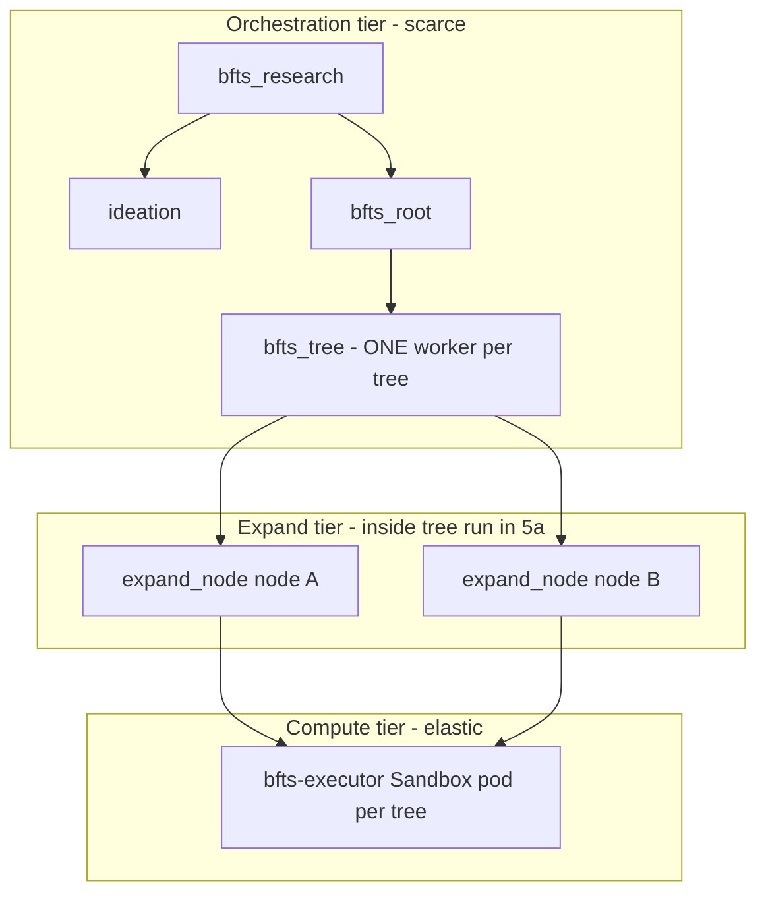
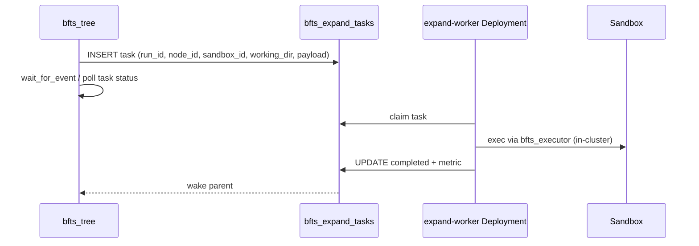

# BFTS Phase 5 — Orchestration vs expand execution

Design sketch for decoupling **tree control** from **node expansion** so BFTS stops competing with `ideation`, `save_papers`, and Slack turns for the same small workflow worker pool.

**Context:** Phase 4 (“Design B-lite”) fans each tree node out as a child workflow `bfts_expand_one`. That preserved per-LLM-call durability but multiplied `workflow_runs` rows and worker claims. On a single API pod / Mac dev cluster, `WORKFLOW_WORKER_CONCURRENCY` became the real scheduler — not sandbox count or `num_workers`.

**Status:** proposal / sketch — not implemented.

---

## Problem statement (first principles)

Centaur has two resource layers:

| Layer | Unit | Scales with |
|-------|------|-------------|
| **Orchestration** | `WORKFLOW_WORKER_CONCURRENCY` asyncio workers in the API pod | Pod replicas × concurrency (hard cap per replica) |
| **Experiment compute** | `bfts-executor` Sandbox CR pods | K8s quota, cluster CPU/RAM |

Phase 4 correctly scaled **sandboxes** (one per draft tree, pause/resume between iterations) but scaled **orchestration** by spawning **one workflow run per node expansion**. Every `bfts_expand_one` child must be claimed, run 5–7 LLM `ctx.step`s, and hold a worker for the full expand duration.

Symptoms are predictable:

- **Worker starvation** — `ideation` / `save_papers` sit in `waiting` while all slots run `bfts_expand_one`.
- **Synthetic 502s** — many concurrent LLM calls through one iron-proxy (~30s upstream timeout), not executor OOM.
- **Silent Slack** — parent `bfts_research` completes while `bfts_root` children still run (partially addressed in overlay ≥ `sha-2b6998d`).

Lowering `WORKFLOW_WORKER_CONCURRENCY` is a **tactical** trade (fewer proxy storms, short workflows get slots sometimes). Phase 5 is the **strategic** fix.

---

## Goals

1. **One worker slot per tree** (or per `bfts_root`), not per node expansion, under normal research defaults (`num_drafts=2`, `num_workers=1`).
2. **Preserve durability** — resume mid-expand at LLM/exec step granularity; `bfts_nodes` remains source of truth.
3. **Preserve sandbox isolation** — shared sandbox per tree, distinct `working_dir` per parallel sibling (Phase 4h contract).
4. **Backpressure** — explicit limits on parallel LLM/exec (proxy + provider), not “infinite workers.”
5. **Operability** — queue depth, expand latency, proxy timeout rate visible without raw SQL.

## Non-goals (Phase 5)

- Rewriting the Sakana selector / metric reducer.
- Unlimited cluster-wide parallelism (cost and rate limits stay real).
- Changing `.centaur` submodule behavior (upstream PRs are separate tracks: API header enrichment, proxy timeout, workflow priority).

---

## Options considered

### A. Scale workflow workers only (infra)

- More API replicas and/or higher `WORKFLOW_WORKER_CONCURRENCY`; raise iron-proxy timeout.

**Pros:** No overlay code change.  
**Cons:** Linear cost; more workers → more concurrent LLM → **more 502s** unless proxy and quotas scale; Mac single-node still one replica unless you add pods; does not fix “100 workflow runs per research job.”

**Verdict:** necessary complement, not sufficient.

### B. In-tree parallel expand (recommended Phase 5a)

- Remove `bfts_expand_one` **child workflow** fan-out from `bfts_tree`.
- `bfts_tree.handler` runs up to `num_workers` expansions **inside the same workflow run** via bounded `asyncio.gather`.
- `expand_node()` stays the pipeline; checkpoint step names are **namespaced by `node_id`** so parallel siblings do not collide in `workflow_checkpoints`.

**Pros:** One worker per tree; same DB schema; smallest conceptual move from Phase 4.  
**Cons:** Longer single-run lease; must namespace steps; tree handler becomes heavier (still one process).

**Verdict:** **default path.**

### C. Dedicated expand worker Deployment (Phase 5b)

- Separate Centaur API pods (or sidecar) with `WORKFLOW_WORKER_ENABLED=1`, high concurrency, **no HTTP** (or internal only).
- Still child workflows, but workers do not serve Slack/agent traffic.

**Pros:** Isolates BFTS load from interactive API without rewriting expand fan-out.  
**Cons:** Requires upstream or infra support for **claim filters** (only `bfts_expand_one`) — not in Centaur today; doubles operational surface.

**Verdict:** optional if 5a is insufficient on multi-replica prod.

### D. K8s Job / queue workers for expand (Phase 5c)

- `bfts_tree` enqueues expand jobs (Job CR or custom `bfts_expand_tasks` table + worker Deployment).
- Job runs `expand_node` equivalent, writes `bfts_nodes`, signals completion via DB row or `POST /workflows/events`.
- Tree workflow `wait_for_event` instead of `wait_for_workflow`.

**Pros:** True horizontal scale of expand CPU/LLM; sandboxes and jobs scale independently.  
**Cons:** Largest build; new failure modes; need idempotency, job TTL, secrets on job pods.

**Verdict:** target architecture for **large** clusters / many concurrent research runs; not required for dev Mac relief.

---

## Recommended architecture (Phase 5a + incremental 5b/c)



**Worker budget (research defaults):**

| Workflow | Phase 4 workers (worst case) | Phase 5a workers |
|----------|------------------------------|------------------|
| `bfts_research` | 1 | 1 |
| `ideation` child | 1 | 1 |
| `bfts_root` | 1 | 1 |
| `bfts_tree` × `num_drafts` | 2 | 2 |
| `bfts_expand_one` × trees × workers × iters | **many** | **0** (in-tree) |

With `num_drafts=2`, Phase 5a caps steady-state orchestration at **~4–5** workflow runs per research job instead of **4 + 2×iters×workers** expand children.

---

## Phase 5a — In-tree parallel expand (detailed)

### 5a.1 Namespaced checkpoints

`expand_node` today uses global step ids (`draft_propose`, `draft_exec`, …). Parallel expands in one workflow **must** prefix steps:

```text
expand_{node_id8}_draft_propose
expand_{node_id8}_draft_exec
…
```

Implementation sketch:

- Add `step_prefix: str` to `ExpandContext` (default `""` for backward compat).
- `expand_node` builds `step_name = f"{prefix}draft_propose"` when prefix set.
- `bfts_tree` sets `prefix=f"expand_{node_id[:8]}_"`.

**Invariant:** replay of tree run resumes the correct node’s checkpoint, not a sibling’s.

### 5a.2 `bfts_tree` iteration loop (replace child fan-out)

Replace:

```python
child = await ctx.start_workflow(..., workflow_name="bfts_expand_one", ...)
await ctx.wait_for_workflow(...)
```

With:

```python
sem = asyncio.Semaphore(search.num_workers)

async def _run_one(node_id, parent_row):
    async with sem:
        prior = await ctx.step(f"load_prior_{node_id[:8]}", ...)
        result = await expand_node(ctx, expand_ctx)  # namespaced steps inside
        await ctx.step(f"update_node_{node_id[:8]}", lambda: update_node_metric(...))
        ...

await asyncio.gather(*[_run_one(nid, row) for nid, row in prepared])
```

**Keep:**

- `insert_node` placeholders before expand (same as today).
- `resume_sandbox` / `pause_sandbox` timing (pause only after **all** siblings in the iteration complete).
- `mark_node_failed` on expand exception (try/except per node, not per child workflow status).

**Remove (or deprecate):**

- `start_workflow("bfts_expand_one")` from production path.
- `workflows/bfts_expand_one.py` remains for **manual replay / tests** until deprecated.

### 5a.3 Failure semantics

| Event | Behavior |
|-------|----------|
| `expand_node` raises | Catch in `_run_one`, `mark_node_failed`, sibling continues |
| LLM 502 after retries | Same — node marked failed, tree may debug/replace on next iter |
| Tree handler crash | Workflow lease expires; tree reclaimed; namespaced steps replay from last checkpoint **per node** |
| Sandbox tool failure | Unchanged — `_coerce_exec_result` → buggy node |

Child-workflow `ChildWorkflowFailed` path goes away; failures are in-process exceptions.

### 5a.4 Concurrency vs proxy

`num_workers` becomes a **semaphore inside the tree**, not “number of workflow children.” Defaults stay `1` for research; operators can raise to `2` on clusters with higher proxy timeout and Anthropic quota.

Optional: **global LLM semaphore** in `packages/bfts_sdk/llm.py` (env `BFTS_LLM_MAX_INFLIGHT`) across all trees on one API pod — second line of defense against 502 storms.

### 5a.5 Tests

- Unit: step name prefixing in `expand_node` (two fake expands, distinct checkpoint keys).
- Integration: `bfts_tree` with `num_workers=2`, mock LLM/exec, assert one workflow run, two nodes updated.
- Regression: `test_bfts_root_lifecycle.py` unchanged intent (sandbox not paused mid-iteration).

---

## Phase 5b — Expand worker pool (optional)

When a single API pod cannot host enough tree runs (many concurrent `bfts_root`):

1. **Infra:** second Deployment `centaur-workflow-worker` — same image, `WORKFLOW_WORKER_ENABLED=1`, no ingress, `WORKFLOW_WORKER_CONCURRENCY=32`.
2. **Upstream Centaur:** `WORKFLOW_CLAIM_WORKFLOW_NAMES=bfts_expand_one` (proposed env) OR priority queue in claim SQL.

If 5a landed, 5b is only needed if you **reintroduce** child expands for isolation; otherwise scale **tree** workers and keep expands in-tree.

---

## Phase 5c — Job-backed expand (optional, scale-out)

For many simultaneous research jobs across a cluster:



**New table (sketch):**

```sql
CREATE TABLE bfts_expand_tasks (
  task_id       TEXT PRIMARY KEY,
  run_id        TEXT NOT NULL,
  node_id       TEXT NOT NULL,
  status        TEXT NOT NULL,  -- queued | running | completed | failed
  payload_json  JSONB NOT NULL,
  error_text    TEXT,
  worker_id     TEXT,
  lease_expires_at TIMESTAMPTZ,
  created_at    TIMESTAMPTZ DEFAULT now(),
  updated_at    TIMESTAMPTZ DEFAULT now()
);
```

Tree waits on `task_id` correlation instead of `workflow_runs.run_id`. Expand workers run a thin Python loop (not full Centaur HTTP) with same `expand_node` library code.

**When to build:** multi-tenant or >10 concurrent `bfts_root` runs; not required for Mac dev cluster relief.

---

## Observability (Phase 5d, cross-cutting)

Add to overlay / `vm_metrics` (no submodule edits required for metrics emission from workflows):

| Metric | Labels | Purpose |
|--------|--------|---------|
| `bfts_expand_duration_seconds` | `stage`, `branch` | LLM/exec latency |
| `bfts_expand_inflight` | `run_id` or global | Backpressure tuning |
| `bfts_tree_iteration_total` | `run_id` | Progress |
| `workflow_claim_wait_seconds` | `workflow_name` | Starvation detection |

Logs: `ctx.log("bfts_tree_iteration", iter=..., inflight=..., nodes=...)`.

Slack: keep BFTS stream; add “iteration N, M nodes expanded” from tree (not per child `wfr_*`).

---

## Migration and rollout

| Step | Deliverable | Risk |
|------|-------------|------|
| **5a.0** | `step_prefix` on `ExpandContext` + tests | Low |
| **5a.1** | In-tree expand in `bfts_tree`; remove child fan-out | Medium |
| **5a.2** | Keep `bfts_expand_one` for manual replay only | Low |
| **5b** | Optional worker Deployment + upstream claim filter | Infra + upstream |
| **5c** | Job queue | High — separate project |

**Rollback:** revert overlay deploy to pre-5a image (git revert), not an env toggle.

---

## Mac / single-node vs production

| Constraint | Mac dev cluster | Multi-replica prod |
|------------|-----------------|---------------------|
| API replicas | 1 | N |
| Rosetta / amd64 sandboxes | Yes | Often native amd64 |
| Phase 5a benefit | **Large** — removes expand run explosion | **Large** — same |
| Phase 5b benefit | Low (one replica) | High |
| Phase 5c benefit | Overkill | High at scale |

Phase 5a is **not** “fix Mac code” — it fixes an **architectural unit of work** (workflow run = tree iteration batch, not single LLM pipeline). Mac benefits disproportionately because the worker pool is tiny.

---

## Open questions

1. **Lease duration:** long in-tree expands hold one worker lease for minutes — increase `WORKFLOW_WORKER_LEASE_S` or heartbeat during `expand_node`? (Check upstream lease extension on step boundaries.)
2. **Seed nodes (F.4):** same in-tree path with `seed_override` — no separate workflow.
3. **Reflection / nightly:** unchanged; not expand-heavy.
4. **Upstream proxy timeout:** still needs infra bump for tail latency even after 5a.

---

## Summary

| Phase | What changes the game |
|-------|------------------------|
| **4 (today)** | Durable per-expand **child workflow** — correct replay, wrong scheduler unit |
| **5a** | Expand **inside `bfts_tree`** with namespaced steps — **one worker per tree** |
| **5b** | Optional dedicated workflow replicas |
| **5c** | Job queue for cluster-scale expand |
| **Infra** | Proxy timeout + (optional) more tree-worker replicas |

**Recommendation:** ship **5a** (in-tree expand only); validate on dev cluster with VictoriaLogs proxy timeout rate; raise iron-proxy upstream timeout in infra.
